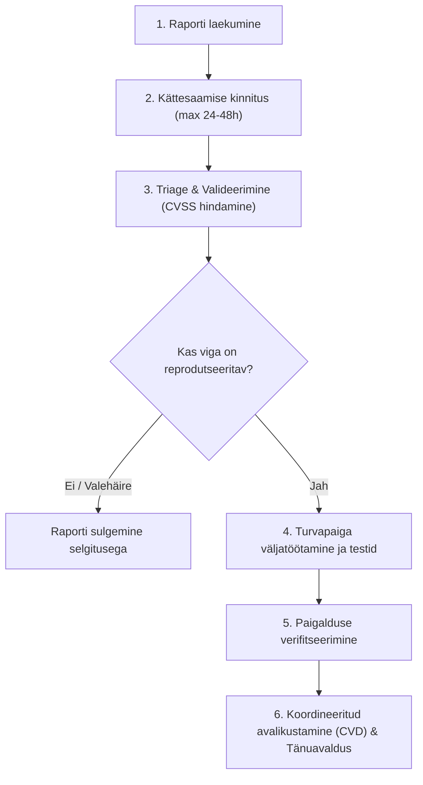

# 🛡️ Tehniline Turvastandard: ISO/IEC 29147:2018 Rakendusjuhend (Vulnerability Disclosure Policy)

**Dokumendi nimetus:** NewsPortal Haavatavuste Tuvastamise ja Avalikustamise Turvastandard  
**Alusstandard:** ISO/IEC 29147:2018 (*Information technology — Security techniques — Vulnerability disclosure*)  
**Seotud standard:** ISO/IEC 30111:2019 (*Information technology — Security techniques — Vulnerability handling processes*)  
**Kehtivus:** Alates september 2026  
**Sihtrühm:** Arendusmeeskond, süsteemiadministraatorid, turbeuurijad (Security Researchers), eetilised häkkerid ja kolmandad osapooled.

---

## 1. Standardi eesmärk ja reguleerimisala (Scope)

Käesolev tehniline standard sätestab ametlikud nõuded ja protseduurid potentsiaalsete turvanõrkuste ja haavatavuste (vulnerabilities) vastuvõtmiseks, uurimiseks, parandamiseks ja koordineeritud avalikustamiseks NewsPortali veebiplatvormil vastavalt rahvusvahelisele standardile **ISO/IEC 29147:2018**.

Standardi peamised eesmärgid:
1. Pakkuda turbeuurijatele turvalist, selget ja seaduslikku kanalit vigadest teatamiseks (*Safe Harbor*).
2. Minimeerida süsteemi ja kasutajate andmetele tekkida võivaid riske enne turvapaiga avaldamist.
3. Määratleda kindlad teenustaseme lepingud (SLA) raportite käsitlemiseks ja paranduste juurutamiseks.
4. Koordineerida avalikkuse ja kasutajate teavitamist (*Coordinated Vulnerability Disclosure - CVD*).

---

## 2. Mõisted ja lühendid (Terms & Definitions)

Vastavalt ISO/IEC 29147:2018 jaotisele 3 kasutatakse järgmisi termineid:

- **Haavatavus (Vulnerability):** Süsteemi loogika, koodi või konfiguratsiooni nõrkus, mida ründaja saab ära kasutada süsteemi konfidentsiaalsuse, tervikluse või kättesaadavuse rikkumiseks.
- **Teavitaja (Reporter / Finder):** Isik või organisatsioon (eetiline häkker, turbeuurija, kasutaja), kes avastab haavatavuse ja edastab selle NewsPortali meeskonnale.
- **Tarnija / Arendaja (Vendor):** NewsPortali omanik ja arendustiim, kes vastutab koodi haldamise ja paranduste loomise eest.
- **Koordinaator (Coordinator):** Kolmas osapool (nt CERT-EE, RIA või GitHub Security Lab), kes aitab vahendada teavet mitme osapoole vahel.
- **Koordineeritud haavatavuse avalikustamine (Coordinated Vulnerability Disclosure - CVD):** Protsess, mille käigus teavitaja ja arendaja lepivad kokku, et haavatavuse detaile ei avalikustata avalikkusele enne, kui tõhus turvapaik on valmis ja paigaldatud.
- **CVSS (Common Vulnerability Scoring System):** Tööstusstandard haavatavuste tõsiduse numbriliseks hindamiseks (skaalal 0.0 kuni 10.0).

---

## 3. Haavatavuste avalikustamise poliitika (Vulnerability Disclosure Policy - Clause 5.2)

### 3.1 Ohutu Sadam (Safe Harbor) heatahtlikele uurijatele
NewsPortal toetab vastutustundlikku ja eetilist turvalisuse testimist. Me kinnitame, et ei algata õiguslikke samme uurijate vastu, kes:
1. Tegutsevad heas usus (*good faith*) eesmärgiga parandada süsteemi turvalisust.
2. Ei kuritarvita leitud vigu (nt andmete massiline allalaadimine, kustutamine või muutmine).
3. Ei häiri portaali tavapärast tööd (DoS/DDoS katsed on rangelt keelatud).
4. Annavad arendusmeeskonnale mõistliku aja (vastavalt käesolevale standardile) vea parandamiseks enne teabe avalikustamist.

### 3.2 Testimise ulatus (Scope)
- **Hõlmatud sihtmärgid (In-Scope):**
  - Veebiportaal: `http://localhost/NewsPortal/` (ja toodangudomeenid).
  - Kõik avalikud ja halduslehed (`index.php`, `news.php`, `login.php`, `register.php`, `profile.php`, `admin/*`).
  - REST/JSON API otspunktid (`api/search.php`, `api/comments.php`, `api/reactions.php`).
- **Välistatud (Out-of-Scope):**
  - Teenustõkestusründed (Denial of Service / DoS / DDoS).
  - Sotsiaalse manipulatsiooni ründed (Phishing, Social Engineering) töötajate või toimetajate vastu.
  - Füüsilised ründed serveriruumide või infrastruktuuri vastu.
  - Automaatsed skännerid, mis tekitavad suurt serverikoormust ilma konkreetse PoC (Proof of Concept) tõendusmaterjalita.

---

## 4. Teadete vastuvõtmise kanalid ja kontaktid (Clause 5.3)

Standardi kohaselt tagab NewsPortal selgelt leitavad ja turvalised kontaktpunktid:

1. **Ametlik turvakontakt:**
   - E-post: `security@newsportal.local` (toodangus: `security@newsportal.ee`)
   - GitHub Security Advisories: [https://github.com/Terabyte23/NewsPortal/security](https://github.com/Terabyte23/NewsPortal/security)
2. **Standardne `security.txt` fail (RFC 9116 / ISO 29147):**
   - Asukoht: `http://localhost/NewsPortal/.well-known/security.txt`
3. **Raportis nõutav teave:**
   - Haavatavuse tüüp (nt SQLi, XSS, CSRF, IDOR, Authentication Bypass).
   - Mõjutatud failid, parameetrid ja URL-id.
   - Samm-sammuline taastekitamise juhend (Step-by-step reproduction steps / PoC).
   - Tõsiduse hinnang (hinnanguline CVSS skoor või mõju kirjeldus).

---

## 5. Haavatavuste käsitlemise elutsükkel (ISO/IEC 29147 & 30111)



### 5.1 Faas 1: Laekumine ja kättesaamise kinnitamine (Acknowledgment)
- **SLA: Maksimaalselt 24–48 tunni jooksul** alates raporti saabumisest edastab NewsPortali turvavastutav teavitajale kinnituskirja koos unikaalse intsidendi ID-ga (nt `NP-SEC-2026-001`).

### 5.2 Faas 2: Triage ja tõsiduse hindamine (Assessment)
Arendusmeeskond klassifitseerib leiu vastavalt **CVSS v3.1** skaalale:

| Tase | CVSS v3.1 skoor | Parandamise SLA | Näited |
| :--- | :--- | :--- | :--- |
| **Kriitiline (Critical)** | 9.0 – 10.0 | **Kuni 24 tundi** | Koodi kaugkäitamine (RCE), SQL süstimine autentimisest möödahiilimisega, andmebaasi täielik kompromiteerimine. |
| **Kõrge (High)** | 7.0 – 8.9 | **Kuni 72 tundi** | Salvestatud XSS (Stored XSS) administraatorile, CSRF kriitilistel toimingutel (parooli muutmine, uudise kustutamine), volitamata rolli ülendamine. |
| **Keskmine (Medium)** | 4.0 – 6.9 | **Kuni 7 tööpäeva** | Peegeldatud XSS (Reflected XSS), kiiruspiirangu puudumine (Rate Limiting), tundliku info leke veateadetes. |
| **Madal (Low)** | 0.1 – 3.9 | **Kuni 30 päeva** | Turvapäiste puudumine (nt puuduv X-Frame-Options), kasutajanimede loetlemine (Username Enumeration). |

### 5.3 Faas 3: Turvapaiga arendus ja testimine (Remediation)
1. Parandust arendatakse eraldi turvalises harus (`hotfix/sec-issue-XXX`).
2. Luuakse automatiseeritud regressioonitest failis `tests/SecurityTest.php` või `tests/EndToEndTest.php`, mis tõestab vea esinemist enne ja lahenemist pärast koodimuudatust.
3. Viiakse läbi koodi ülevaatus (Peer Review).

### 5.4 Faas 4: Turvapaiga paigaldamine ja avalikustamine (Disclosure)
- Standardne koordineerimisperiood on **30 kuni 90 päeva**, sõltuvalt vea keerukusest.
- Pärast turvapaiga edukat paigaldamist toodangusse:
  1. Teavitatakse teavitajat ja tänatakse koostöö eest.
  2. Avaldatakse turvateade (Security Advisory) versioonimuudatuste logis (Changelog).
  3. Lisatakse teavitaja soovi korral NewsPortali aumüürile (*Hall of Fame*).

---

## 6. NewsPortali turvakontrollide baastase (OWASP Top 10 vastavus)

Platvormi arenduses rakendatakse ISO/IEC 29147 ja OWASP soovitustele vastavaid kaitsekihte:

### 6.1 SQL süstimise (SQL Injection) tõkestamine
- Kõik andmebaasipäringud, mis töötlevad kasutaja sisendit, kasutavad eranditult parameetriseeritud ettevalmistatud päringuid (`Prepared Statements`):
  ```php
  $stmt = $conn->prepare("SELECT * FROM comments WHERE news_id = ?");
  $stmt->bind_param("i", $newsId);
  $stmt->execute();
  ```

### 6.2 Läbisaidilise skriptimise (XSS) tõkestamine
- Iga kasutaja sisestatud teksti kuvamisel veebilehele kasutatakse rangeid filtreerimisfunktsioone:
  ```php
  htmlspecialchars($rawString, ENT_QUOTES, 'UTF-8');
  ```

### 6.3 Päringute võltsimise (CSRF) kaitse
- Kõik kriitilised toimingud (kommentaari kustutamine, uudise muutmine, profiili uuendamine) on kaitstud krüptograafiliste 64-kohaliste räsidega (`csrf_token()` ja `verify_csrf_token()`):
  ```php
  if (!verify_csrf_token($_POST['csrf_token'] ?? '')) {
      die("CSRF turvakontroll ebaõnnestus!");
  }
  ```

### 6.4 Paroolide turvaline säilitamine
- Paroole ei salvestata mitte kunagi avatekstina ega aegunud algoritmidega (MD5, SHA1).
- Kasutatakse kaasaegset kohanduva soolaga **Bcrypt** algoritmi:
  ```php
  $hash = password_hash($password, PASSWORD_DEFAULT);
  password_verify($password, $hash);
  ```

---

## 7. Turvateate (Security Advisory) avaldamise mall

Haavatavuse lahendamisel avalikustatakse teade järgmises formaadis:

```markdown
### [NP-SA-2026-001] Haavatavuse pealkiri

- **Avaldamise kuupäev:** YYYY-MM-DD
- **Tõsiduse aste:** High (CVSS 7.5: CVSS:3.1/AV:N/AC:L/PR:N/UI:N/S:U/C:N/I:H/A:N)
- **Mõjutatud versioonid:** NewsPortal <= v1.8
- **Parandatud versioonis:** NewsPortal v2.0
- **CVE Identifikaator:** (Vajadusel reserveeritud CVE-ID)

#### Kirjeldus
Üksikasjalik, kuid turvaline ülevaade probleemist ilma ründekoodi avaldamata.

#### Lahendus / Mõjude leevendamine
Kuidas administraatorid saavad süsteemi uuendada või viga lappida.

#### Tunnustus
Täname turbeuurijat [Nimi / Pseudonüüm] professionaalse ja eetilise teavituse eest vastavalt ISO/IEC 29147 standardile.
```

---

## 8. Tunnustused ja Aumüür (Hall of Fame)

NewsPortal avaldab tänu kõigile eetilistele uurijatele, kes on aidanud tõsta portaali turvalisust:
- *Eetiline turbeuurija (September 2026)* — OWASP Top 10 analüüsi ja CSRF modereerimise valideerimise eest.

---
*Kinnitatud NewsPortali arendus- ja turvenõukogu poolt.*  
*Vastavus: ISO/IEC 29147:2018 ja ISO/IEC 30111:2019*
